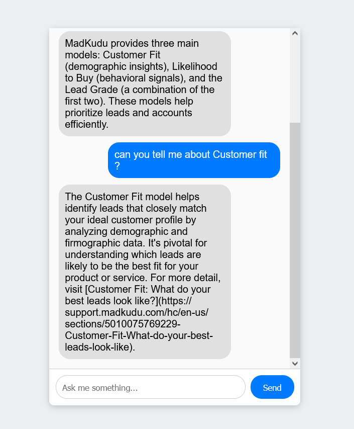

# Chatbot Project

## Overview

This project includes a chatbot developed with Rasa and a front-end interface designed to simulate a chat experience similar to Messenger.

### Structure

The project is divided into two main directories:
- `rasa/`: Contains all the files related to the Rasa chatbot backend.
- `frontend/`: Contains the Flask web server.

## Getting Started

To run this project, you will need to set up both the Rasa backend and the front-end interface.

### Prerequisites

- Python 3.6 or higher
- Rasa installed and set up
- Flask for serving the front-end
- I highly recommend using Firefox as the browser for testing.

### Installation

1. Clone this repository to your local machine.
2. Navigate to the `rasa/` directory and train the Rasa model:

    `rasa train`

3. Start the Rasa server with the following command:
    `rasa run --enable-api --cors "*"`
4. In a separate terminal, navigate to the `frontend/` directory.
5. Start your web server (e.g., Flask) to serve the HTML page:

    `python app.py` (Windows)
   
    `python3 app.py` (Linux/MacOS)

## Usage

1. Open your browser and navigate to the URL served by your web server (e.g., `http://127.0.0.1:5006`).
2. Interact with the chatbot through the web interface.

<table>
  <tr>
    <td>
      
    </td>
    <td>
      
    </td>
    <td>
      
    </td>
  </tr>
</table>

## Features

- Real-time interaction with the chatbot through the web interface.
- Styled to provide a user experience similar to popular messaging applications.

## Customization

- You can train the Rasa model with additional data by modifying the `data/nlu.yml` and `data/stories.yml` files.
- The front-end interface can be customized further by adjusting the `frontend/static/style.css` file.

